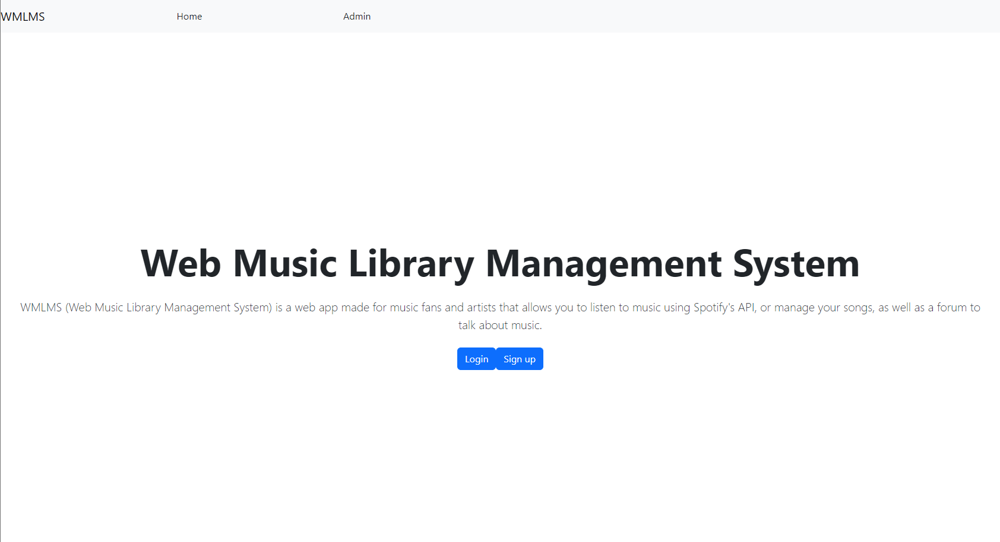
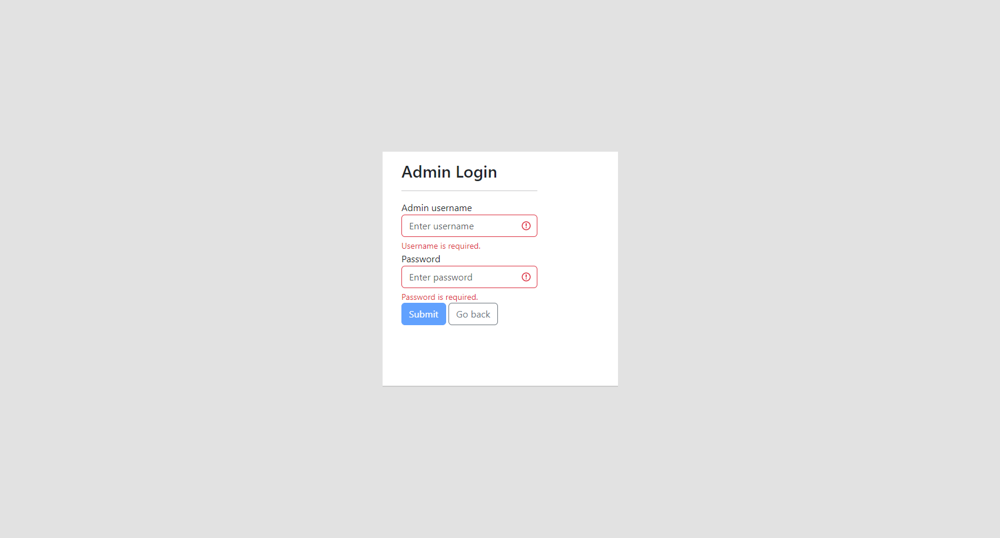
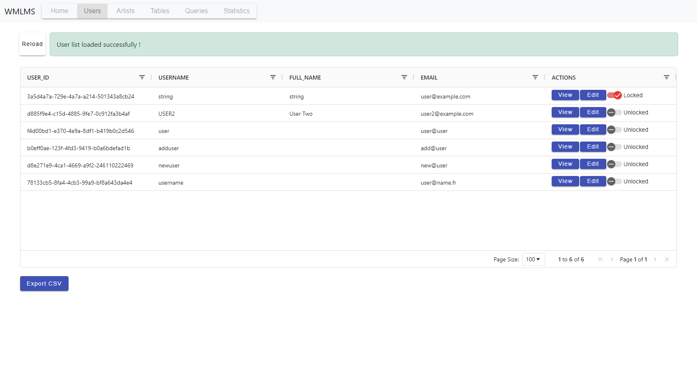
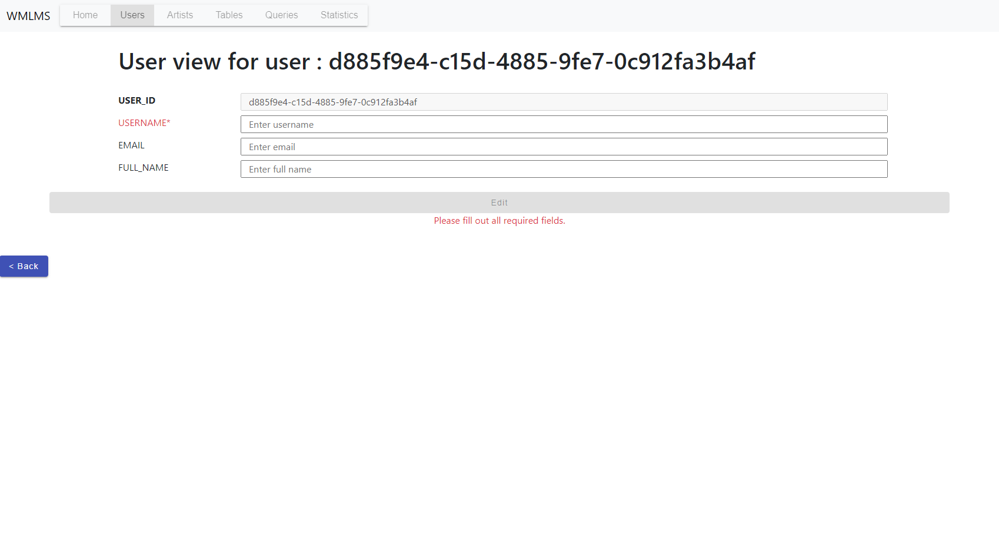
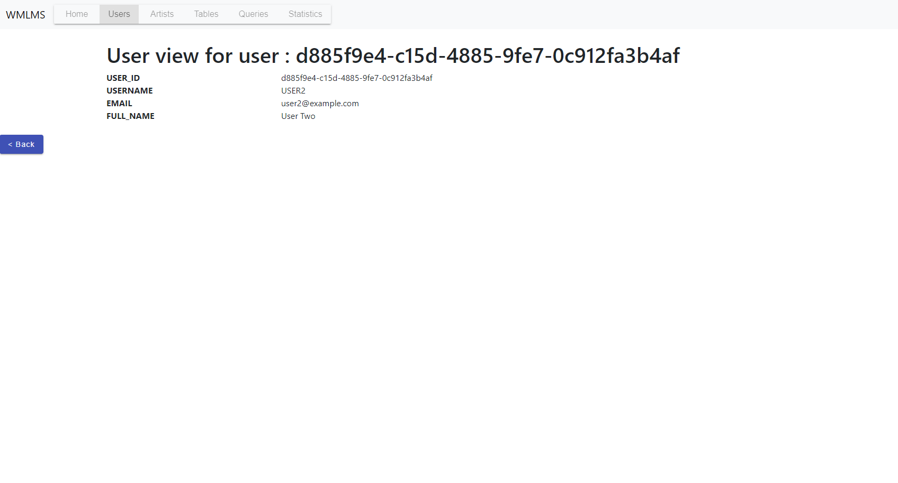
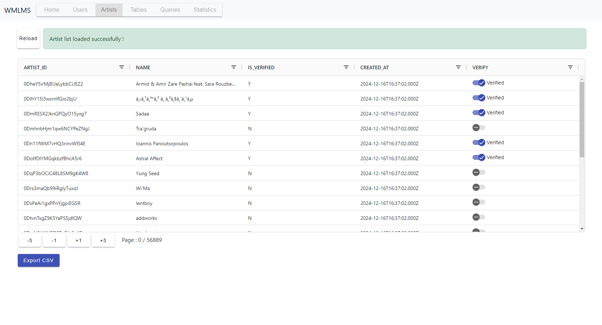
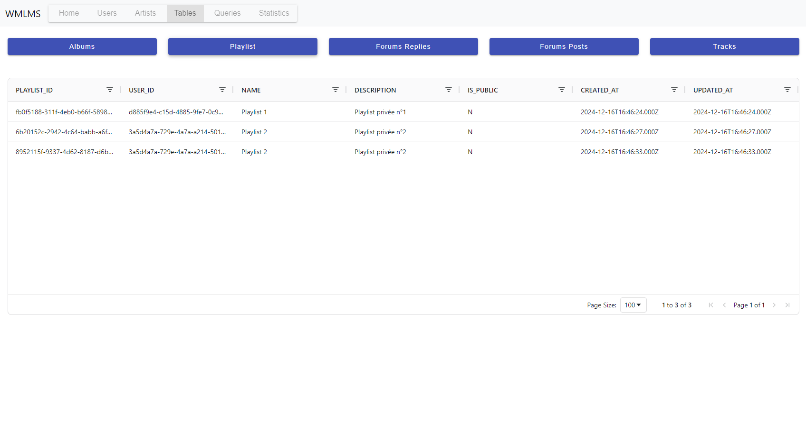

# Node JS & React Project : Web Music Library Managment System (WMLMS)

**Authors (ESILV A4 CDOF3) :** Léandre BROSSIER, Mathys DECKER, Benoît HUA, Kylie WU (Kylie is not registered as a NodeJS & React student)

## Summary

This projects aims to recreate a simple music streaming system with administration tools using the knowledge we acquired during our Advanced Database Management, NodeJS & React and Software Engineering courses.  

The main requirements of all three courses are distributed as following :

- Advanced Database Management : 
  - Database creation, setup and management
  - Queries built on the created database and tables
  - Bonus : Management tool with a graphical interface (such as a webapp) 
  
- NodeJS & React :
  - Build a  webapp using a typescript backend & frontend
  - Developing a CRUD API
  - Using charts (Highcharts), tables (AG Grid)
  
- Software Engineering :
  - Managing a project using the Scrum framework
  - Using GitHub to handle project versions, iterations and increments

## Project Structure : 

```
/
├─ Database         : The sql and python scripts to setup and populate the database
|
├─ WMLMS_Frontend   : The front end (angular / typescript / css / html) code of the tool
|                     This is used for the UI and connects to the back end
|           
├─ WMLMS_Backend    : The back end (node / typescript) code of the tool
|                     This is used to link the database to the front end
|
├─ Advanced Database Management : Final reports, presentation video, installation video
|
├─ NodeJS & React : Presentation video, installation video

```

## Installation guide

You have a video tutorial for the installation steps in the `Advanced Database Management` folder !

### Requirements

- [ ] [Oracle Database XE 21.c (download link)](https://www.oracle.com/database/technologies/xe-downloads.html)
- [ ] [Node.js (download link)](https://nodejs.org/en)

### Database installation and setup

- [ ] Step 0 : Install Oracle Database XE 21.c
- [ ] Step 1 : Pluggable database setup using DATABASE\WMLMS_Step_1_PDB_SETUP.sql
  - [ ] Create a new pluggable database
  - [ ] Create a new user
  - [ ] Open the database and create a new service
- [ ] Step 2 : Prepare and split the dataset using DATABASE\WMLMS_Step_2_Datasets
  - [ ] Unzip the dataset files
  - [ ] Use the python script WMLMS_Step_2_CSV_Separation.py 
- [ ] Step 3 : Setup the database using  DATABASE\WMLMS_Step_3_Database_Setup.sql
  - [ ] Run the installation scripts

### Front end installation and setup

Make sure you have installed Node.js and that it is in your PATH

- [ ] Step 0 : Browse to the WMLMS_Frontend folder with a terminal
- [ ] Step 1 : Install packages with `npm install`

### Back end installation and setup

- [ ] Step 0 : Browse to the WMLMS_Backend folder with a terminal
- [ ] Step 1 : Install packages with `npm install`

### Build the project and run

To bypass the following steps, you can open individually WMLMS_Backend or WMLMS_Frontend in IntelliJ and used predefined configurations :

<p align="center">
 
 
</p>


- [ ] Step 0 : Browse to the WMLMS_Backend folder with a terminal
  - [ ] Run `npx ts-node src/app.ts`
  - [ ] Install additional tools if necessary
- [ ] Step 1 : Browse to the WMLMS_Frontend folder with a terminal
  - [ ] Run `ng serve`

Once both front-end and back-end instances ar running, you can open your browser and navigate to : http://localhost:4200/

Hopefully, if you didn't managed to run or build the project, you have a presentation video in `Advanced Database Management` as well !

## User guide

### User : **Home**

You can access the home page by browsing to http://localhost:4200 on this page wou will be able to register as a new user, log in using an existing user credentials, browse to the user home page using the `Home` navbar entry and reach the Admin panel using the `Admin` button in the navbar.




### Admin : **Login**

Once you click on the `Admin` button in the navbar, you will be redirected to the admin login page. The default credentials are admin/admin and depends on the database user (not the table)



### Admin : **Home page**

There is nothing important to display here, it is quie similar to Webapp home page, without login/register buttons and with a custom navbar for the administration tools.

### Admin : **Users page**

The first tool the adminitrator has is the one to lock / unlock or update user data. 



For each user, you have access to two simple pages to do this.





### Admin : **Artists page**

The second tool, the artist page, only allow the administratr to verify or not the artist. It has a custom pagination tool to limit the loading time and we are fully aware that it will greately reduce the functionality brought by ag grid modules top operate filters and selection since only 20 artists are loaded at the same time.



### Admin : **Tables page**




### Admin : **Queries page**
### Admin : **Statistics page**